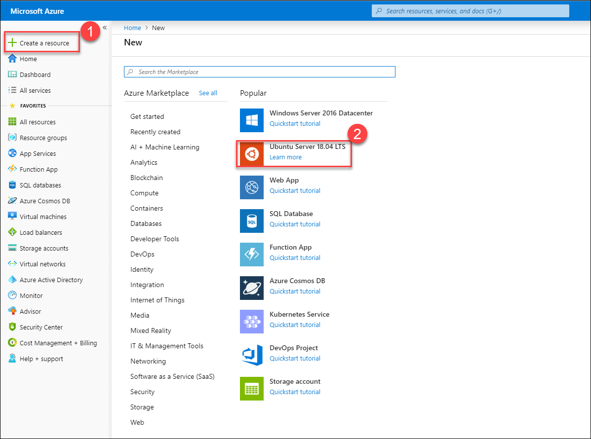

# Exercise 1: Create your first Linux VM (10 minutes)

**1.1 SSH Key Generation**

In this exercise, We'll be generating SSH Keys to authenticate with Linux Virtual Machine
1. Select the **Cloud Shell** from the upper right corner of the Azure Portal.

   
   
2. Select the **BASH** in the cloud shell window.
3. Select the **Show advance setting**.
4. Create a storage account for Bash, provide a unique name for **Storage Account**, **File share** and select the **Cloud Shell region** as **East US** then click on **Create Storage**.

   

5. Run **ssh-keygen -t rsa -b 2048** to generate the ssh key.

   

6. You will be prompted to enter a file in which to save the key pair. Just press Enter to save in the default location, listed in brackets.
7. You will be asked to enter a passphrase. You can type a passphrase for your SSH key or press Enter to continue without a passphrase.
8. To display your public key run **cat /home/odl_user/.ssh/id_rsa.pub**. Copy the contents of the public key for further steps.

**1.2 Create the Ubuntu VM from Azure Portal**

1. Click on the **Create a resource** in the upper left corner of the Azure portal and select **Ubuntu Server 18.04 LTS**.

   
   
2. In the basics tab under the **Project details**, make sure the correct **Subscription** is selected and then choose your ** Resource group** name **linux-empty-unique-id**.

   
   
3. Under the **Instance details**, type the **Virtual Machine Name** , choose your **Region**, select **Ubuntu Server 18.04 LTS** image and select the virtual machine **size** from the following:

   ```
   "Standard_DS2_v2", "Standard_DS1_v2", "Standard_B1ls1", "Standard_B1s", "Standard_B1ms", "Standard_B2s", "Standard_B2ms", "Standard_B4ms", "Standard_B8ms", "Standard_E16-4s_v3", "Standard_E2s_v3", "Standard_E4-2s_v3", "Standard_E4s_v3", "Standard_E8-2s_v3", "Standard_E8-4s_v3", "E16-4s_v3", "E16-8s_v3".
   ```
   
   
   
4. Under the **Administrator account** select the **SSH Public Key** for authentication type. Provide the **User Name** and paste your **Public key**.

   

5. Leave the remaining options defaults and then select the **Review + create** button at the bottom of the page.

6. On the Create a **Virtual Machine Page**, you can see the details about the VM you are about to create. When you are ready, select **Create**.

   
   
7. After some time you can see that your virtual machine successfully deployed.

   

### 1.3 SSH to VM using Public IP

1. To display your virtual machine **Public IP** run below command.

       az vm show -d -g ODL-linux-XXXX -n <VM name>  --query publicIps -o tsv

2. To connect to your virtual machine run below command  

       ssh -i <private key name> azureuser@x.x.x.x -p 22
       
   > x.x.x.x : Replace this with your virtual machine **Public IP**.
   > Run **cd /home/odl_user/.ssh/** to find your private key name
         
    
    
3. Run this command to logout from the Ubuntu machine.

       logout

    

### 1.4 Reset Password of Virtual Machine

1. For reset the password of the Ubuntu virtual machine navigate to the **Resource Group->Virtual Machine->Overview->Support + Troubleshooting->Reset Password**.

   

### 1.5 Access Serial Console of Virtual Machine

1. For using serial console of the Ubuntu virtual machine navigate to the **Resource Group->Virtual Machine->Overview->Support + Troubleshooting->Serial Console**.

   

2. Select the power button to **Restart** or **Reset** the virtual machine.
