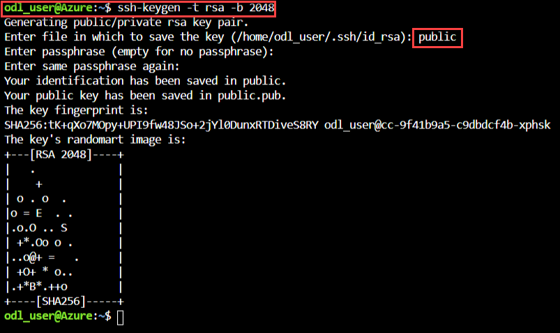
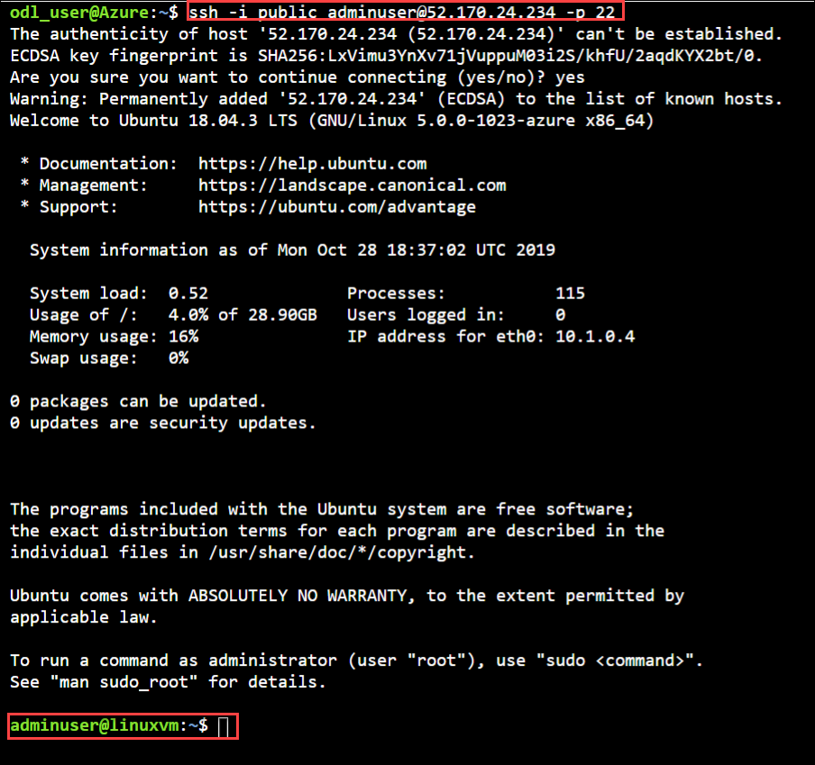

# Exercise 1: Create your first Linux VM (10 minutes)

**1.1 Generate SSH Keys for Linux VM Authentication**

In this exercise, We'll be generating SSH Keys to authenticate with Linux Virtual Machine. 

1. Select the **Cloud Shell** from the upper right corner of the Azure Portal.

   
   
2. Select the **BASH** in the cloud shell window.
3. Select the **Show advance settings**.
4. Create a storage account for **Cloud Shell**, provide a unique name for **Storage Account**, **File share** and select the **Cloud Shell region** as **East US** then click on **Create Storage**. Please note that you've to chhose existing resource group to create this, Since the lab environment doesn't allow you to create new resource groups. 

   

5. Run **ssh-keygen -t rsa -b 2048** command to generate the ssh key.

   

6. You will be prompted to enter a file in which to save the key pair. Just press Enter to save in the default location, listed in brackets.
7. You will be asked to enter a passphrase. You can type a passphrase for your SSH key or press Enter to continue without a passphrase.
8. To display your public key run **cat /home/odl_user/.ssh/id_rsa.pub**. Copy the contents of the public key for further steps.

**1.2 Create the Ubuntu VM from Azure Portal**
In this exercise, You'll be creating a Ubuntu Virtual machine on Azure. 

1. Click on the **Create a resource** in the upper left corner of the Azure portal and select **Ubuntu Server 18.04 LTS**.

   
   
2. In the basics tab under the **Virtual Machine Details**, make sure the existing **Subscription** is selected and then choose your ** Resource group** named **linux-empty-unique-id**.

   
   
3. Under the **Instance details**, Enter the **Virtual Machine Name** , choose your **Region**, select **Ubuntu Server 18.04 LTS** image and select the virtual machine **size** as **Standard_DS1_v2**. Please note all VM Size's are not allowed in the lab environment, Please ensure to chhose the defined VM Size Only. 

   
   
   
4. Under the **Administrator account** select the **SSH Public Key** for authentication type. Provide the **User Name** and paste your **Public key** copied earlier from **Cloud Shell**.

   

5. Leave the remaining options default and then select the **Review + create** button at the bottom of the page.

6. On the Create a **Virtual Machine Page**, you can review the details about the VM you are about to create. When you are ready, select **Create**.

   
   
7. It'll take about 3 to 5 minutes for the VM to be deployed, You can review VM details once it's created. 

   

### 1.3 SSH to VM using Public IP
In this exercise, You'll be accessing the Ubuntu virtual machine deployed earlier through SSH. We'll be using Cloud Shell for this. 

1. First, Let's find out the Public IP of your recently created Virtual Machine. Execute Following command in cloudshell, Please ensure to replace the resource group name **linux-empty-UNIQUEID** and **<VM Name>** with your lab environment values.

       az vm show -d -g linux-empty-XXXX -n <VM name>  --query publicIps -o tsv

2. Run following command to connect to your virtual machine remotely using SSH.  
   > x.x.x.x : Replace this with your virtual machine **Public IP**.
   > Run **cd /home/odl_user/.ssh/** to find your private key name

       ssh -i <private key name> azureuser@x.x.x.x -p 22
          
    
    
3. Run this command to logout from the Ubuntu machine.

       logout

    

### 1.4 Reset Password of Virtual Machine

1. To reset the password of the Ubuntu virtual machine, Navigate to the **Resource Group-> Your Resource Group > Virtual Machine->Overview->Support + Troubleshooting->Reset Password**.

   

### 1.5 Access Serial Console of Virtual Machine

1. To access serial console of the Ubuntu virtual machine, Navigate to the **Resource Group-> Your Resource Group > Virtual Machine-> Overview->Support + Troubleshooting->Serial Console**.

   

2. Select the power button to **Restart** or **Reset** the virtual machine.
