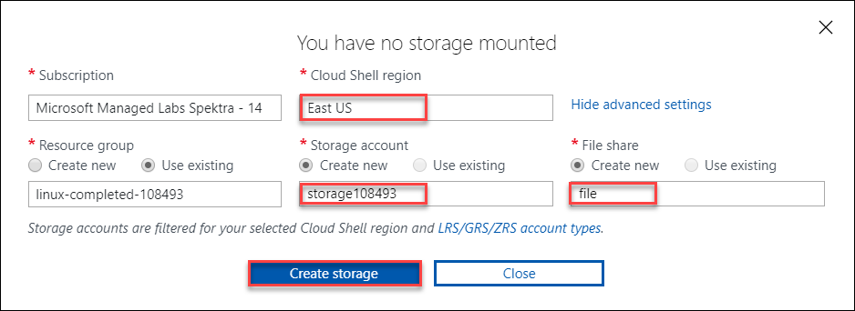
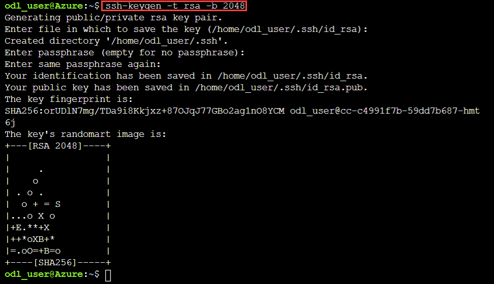

# Exercise 1: Create your first Linux VM (10 minutes)

### 1.1 Generate SSH Keys for Linux VM Authentication

In this exercise, We'll be generating SSH Keys which will be used to authenticate with Linux Virtual Machines. 

1.Select  **Cloud Shell** from the upper right corner of the Azure Portal.

   
   
2.Select the **Bash** in the cloud shell window.

3.Select **Show advance settings**. 

  <kbd>  </kbd>

4.In this step, You'll create a storage account for **Cloud Shell**.  Please provide a unique name for **Storage Account**, **File share**, select the **Cloud Shell region** as **East US** and then click on **Create Storage**. Please note that you've to choose existing resource group named **linux-empty-UNIQUEID** to create this, Since the lab environment doesn't allow you to create new resource groups. 

   

5.Once your cloud shell is ready, run **ssh-keygen -t rsa -b 2048** command to generate the ssh key.

6.You will be prompted to enter a file in which to save the key pair. Just press Enter to save in the default location i.e **/home/odl_user/.ssh/id_rsa**.

7.You will be asked to enter a passphrase. You can type a passphrase for your SSH key or press Enter twice to continue without a passphrase.

   

8.You'll be using the public key while creating the virtual machines, run  **cat /home/odl_user/.ssh/id_rsa.pub** command to view your public key. Please copy the entire content of public key and save in a notepad file for further refrence. 

### 1.2 Create the Ubuntu VM from Azure Portal
In this exercise, You'll be creating a Ubuntu Virtual machine using Azure Portal. Let's get started

1.Click on the **Create a resource** in the upper left corner of the Azure portal and select **Ubuntu Server 18.04 LTS**.

   
   
2.In the basics tab under the **Virtual Machine Details**, make sure the existing **Subscription** and existing  **Resource group** named **linux-empty-unique-id** is selected

   
   
3.Under the **Instance details**, Enter the **Virtual Machine Name** of your choice, choose your **Region**, select **Ubuntu Server 18.04 LTS** image and select the virtual machine **size** as **Standard D2s v3**. Please note all VM Size's are not allowed in the lab environment, Please ensure to choose the defined VM Size Only.
   
   
   
4.Under the **Administrator account** select the **SSH Public Key** for authentication type. Provide the **User Name** of your choice and paste your **Public key** copied earlier from **Cloud Shell**.

   

5.Leave the remaining options default and then select the **Review + create** button at the bottom of the page.

6.On the **Create a Virtual Machine Page**, you can review all configurations of the VM you are about to create. When you are ready, select **Create**.

   
   
7.It'll take about 2 to 4 minutes for the VM to be deployed, Once deployed, You can review the Virtual Machine details on the overview page. 

   
   
   
8.You've now sucessfully created a **Ubuntu Virtual Machine** on Azure. 

### 1.3 SSH to VM using Public IP

In this exercise, You'll be accessing the Ubuntu virtual machine deployed earlier through SSH. We'll be using **Cloud Shell** for this.

1.Let us list down the VMs running in your lab environment using **Cloud Shell**

       az vm list -o table
       
   
   
   
2.Now, Let's find out the Public IP of your recently created Virtual Machine. Execute Following command in **Cloud Shell**, Please ensure to replace the resource group name **linux-empty-UNIQUEID** and **<VM Name>** with your lab environment values, you can review those from last step.

       az vm show -d -g linux-empty-XXXX -n <VM name>  --query publicIps -o tsv

2.Run following command to connect to your virtual machine remotely using SSH. 

   > x.x.x.x : Replace this with your virtual machine **Public IP**.
   > azureuser: Replace this with the username you entered while creating the virtual machine in last step. 

       ssh azureuser@x.x.x.x
          
   
    
4.Type **yes** and hit enter when you're asked if you want to continue connecting to the virtual machine. 

5.You're now connected to your Linux Virtual Machine through SSH. 
    
6.Run this command to logout from the Ubuntu machine.

       logout

    

### 1.4 Reset Password of Virtual Machine
Azure allows you to reset password or ssh key for Virtual Machines using Azure Portal. Let's take a look at how to do reset password or sshkeys for your Linux Virtual Machines. 

1.To reset the password or sshkey of the Ubuntu virtual machine, Navigate to the **Resource Groups > Your Resource Group > Your Virtual Machine > Overview > Support + Troubleshooting >Reset Password**.

   

### 1.5 Access Serial Console of Virtual Machine
The Serial Console in the Azure portal provides access to a text-based console for Linux virtual machines (VMs) and virtual machine scale set instances. This serial connection connects to the ttys0 serial port of the VM or virtual machine scale set instance, providing access to it independent of the network or operating system state. Let's take a look at how to access your Linux VMs using **Serial Console**. 

1.To access serial console of the Ubuntu virtual machine, Navigate to the **Resource Groups > Your Resource Group > Your Virtual Machine > Overview > Support + Troubleshooting > Serial Console**.

   

2.You can also use the power button to **Restart** or **Reset** the virtual machine.

3.Click **Next** on the bottom right of this page to continue with next lab exercise.
